## WiseHire HR Recruitment Management System

Bu proje, insan kaynakları şirketlerinin farklı müşteri şirketler için iş ilanı yayınlaması, aday yönetimi ve raporlama gibi süreçleri yönetmesini sağlayan çok katmanlı bir aday takip sistemidir.

### Özellikler

	•	JWT tabanlı kimlik doğrulama
        •	Bazı sayfalarda template based Django Session kullanıldı
	•	Template based sayfalarda Türkçe ve İngilizce dil desteği (Django Rosetta ile yönetilir)
	•	Docker Compose ile kurulum ve çalıştırma
	•	Celery destekli görev zamanlayıcılar
	•	LaTeX ile PDF rapor üretimi
	•	Nesne bazlı yetkilendirme (object-based permissions)
	•	Birim ve entegrasyon testleri
	•	Django Logging
	•	DB indexleri eklendi
	•	Başlangıç için örnek veri eklendi
	•	Swagger UI eklendi
	•	React tabanlı frontend uygulaması eklendi

### Bazı Ekran Görüntüleri
#### Swagger UI

[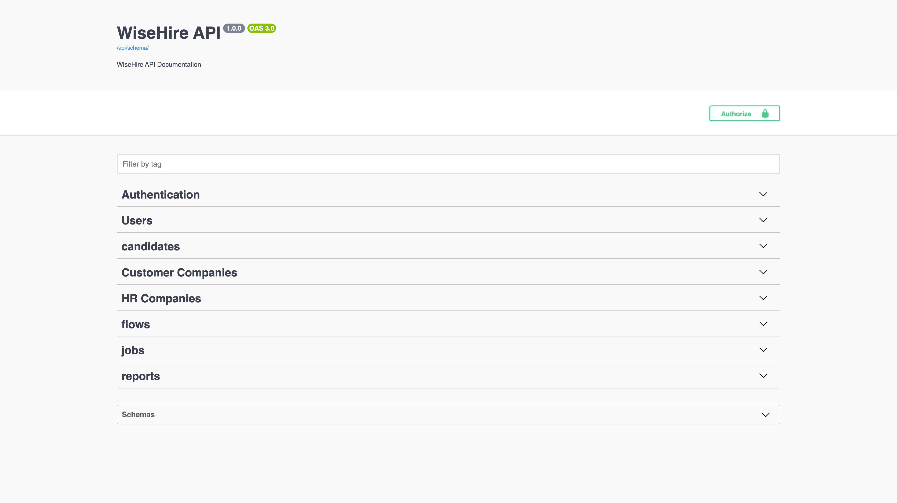](screenshots/swagger.png)

#### SuperUser Tüm Sayfaları Görebilir

[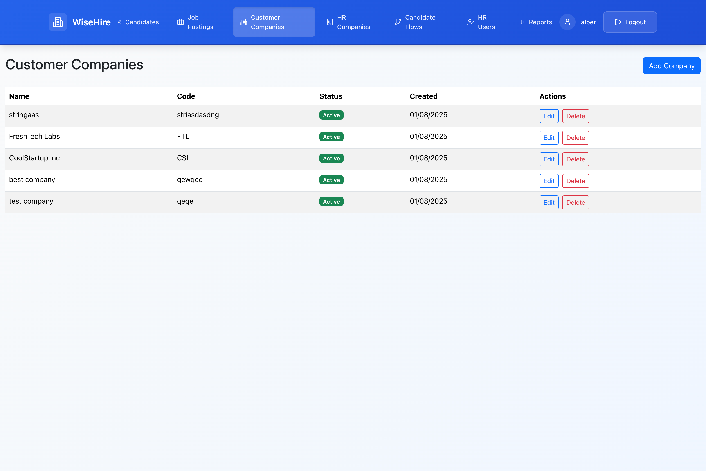](screenshots/superuser-view.png)

#### İK Kullanıcıları Bazı Sayfaları Görebilir

[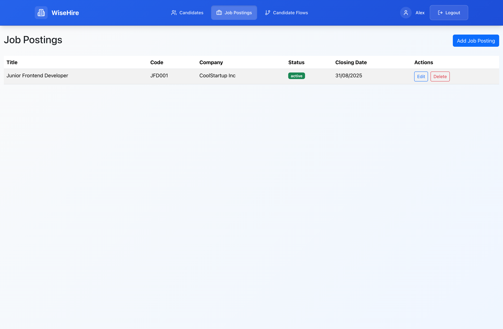](screenshots/limited-view.png)

#### Giriş Ekranı

[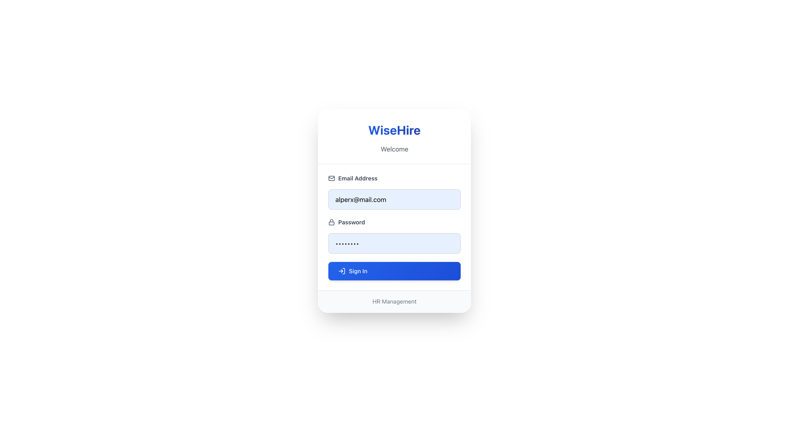](screenshots/login.png)

#### HR Şirketleri (Superadmin görebilir)

[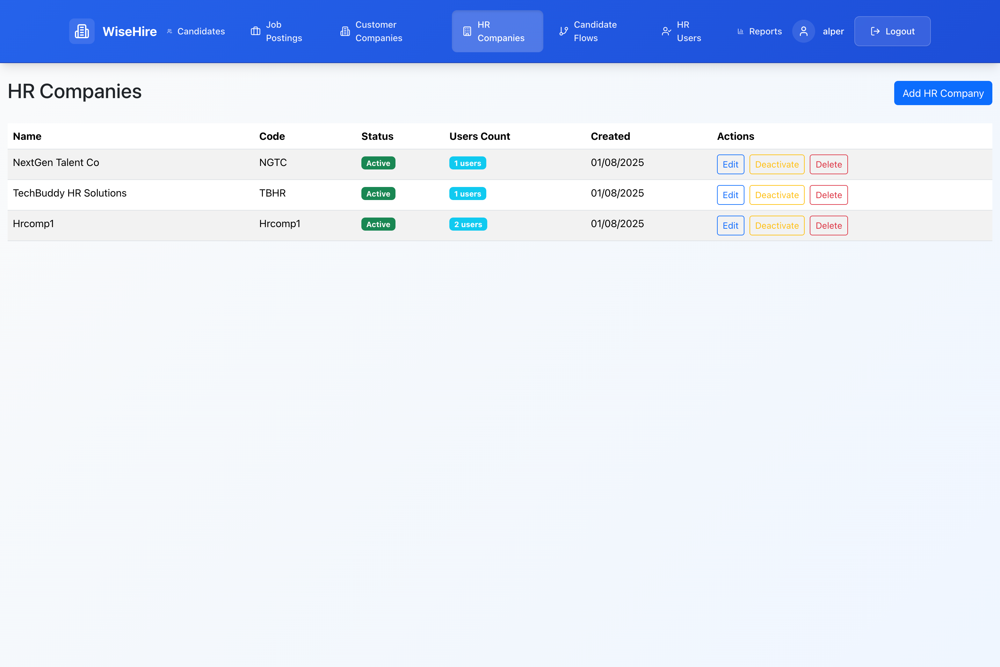](screenshots/hr-companies.png)

#### HR Kullanıcıları (Superadmin görebilir)

[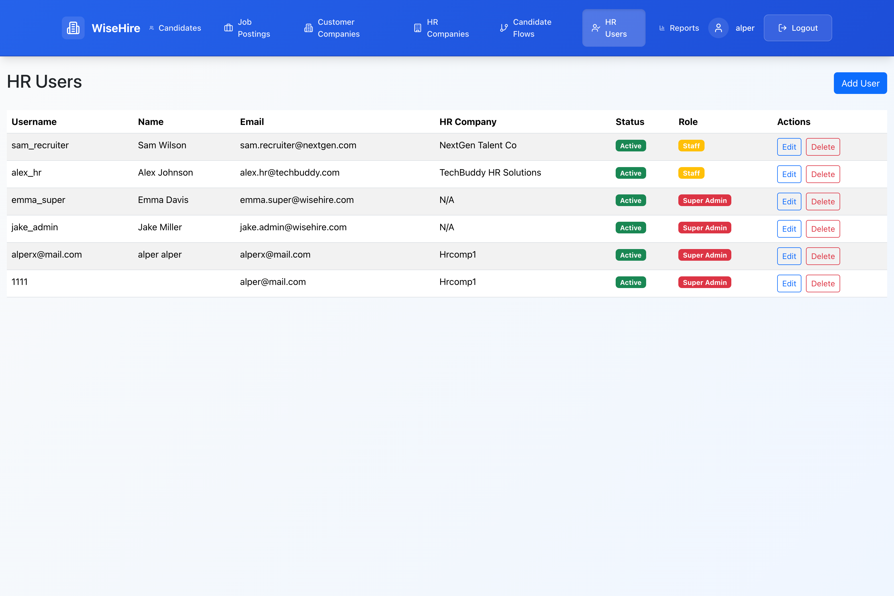](screenshots/hr-users.png)

#### İş İlanları

[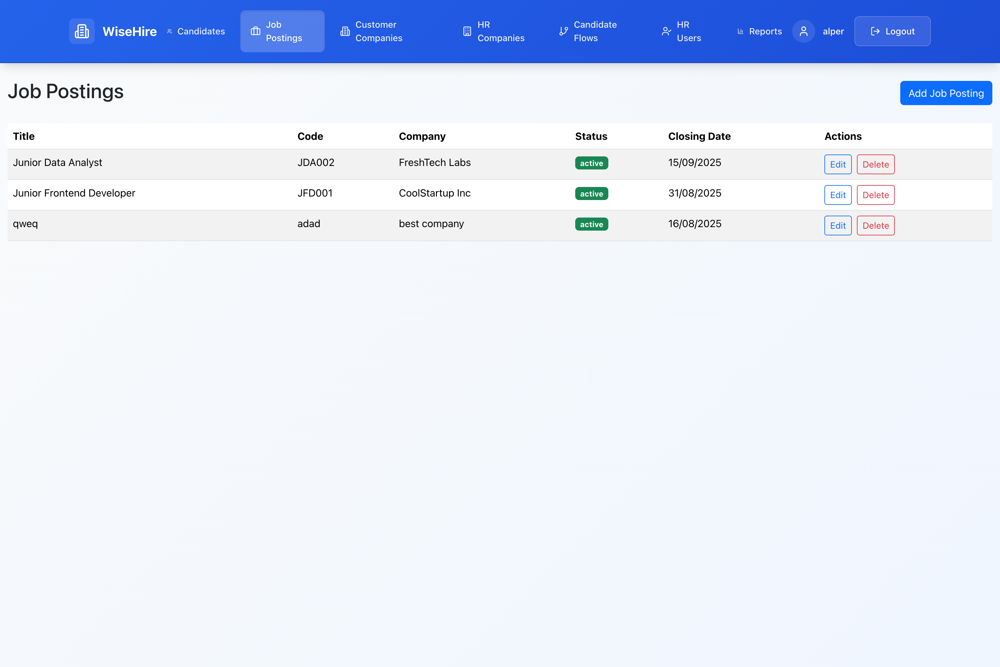](screenshots/jobpostings.png)

#### Adaylar

[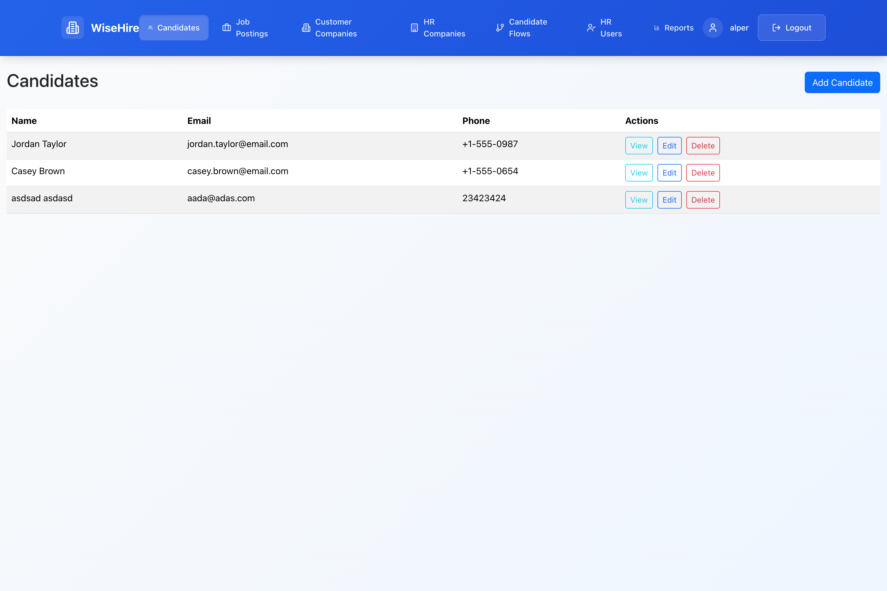](screenshots/candidates.png)

#### Aday Deneyimi

[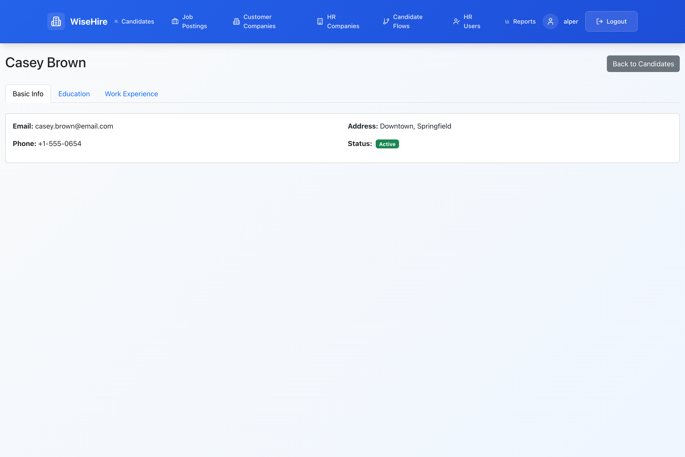](screenshots/candidate-experience.png)

#### Aday Akışları

[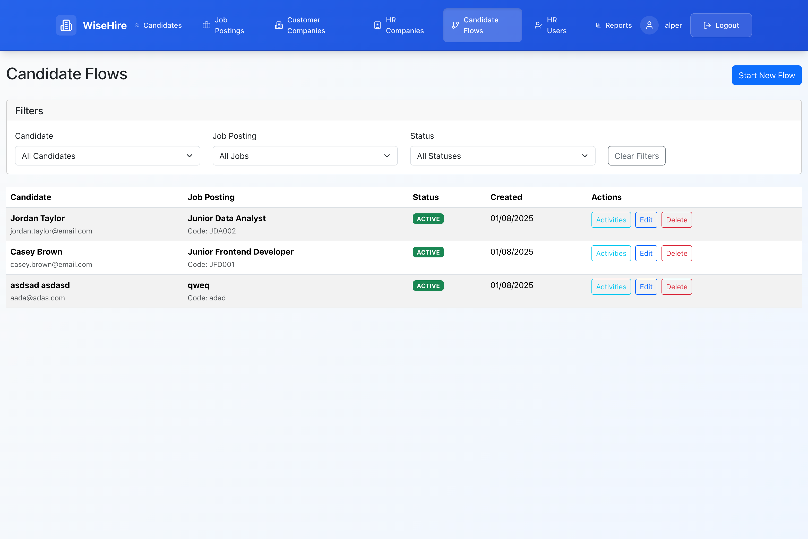](screenshots/candidate-flows.png)

#### Akış Aktiviteleri

[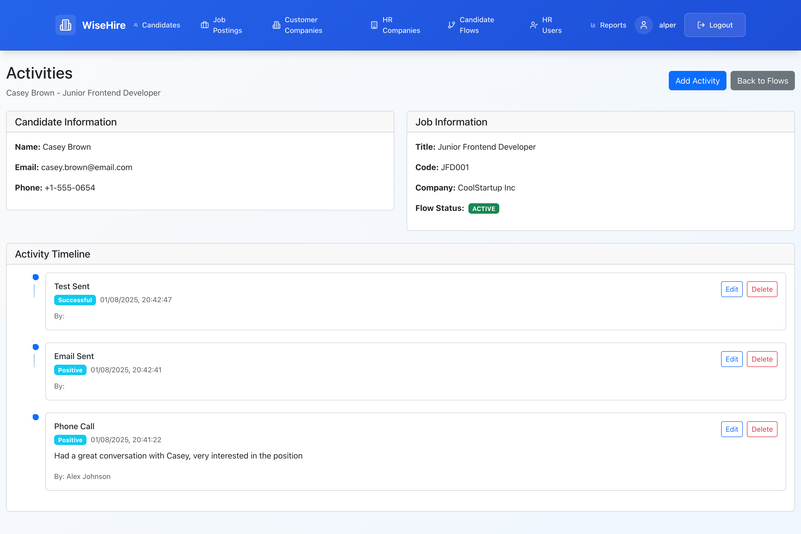](screenshots/flow-activities.png)

#### Raporlar

[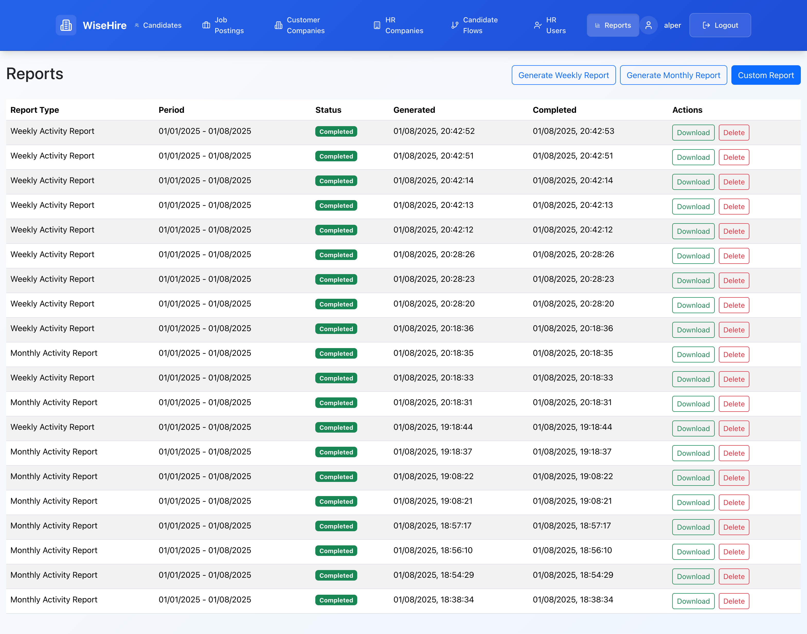](screenshots/reports.png)

### Yetkilendirme

1. Kullanıcıların yetkilendirilmesi için nesne bazlı izinler (object-based permissions) kullanılmıştır. İK kullanıcıları, kendi şirketleri için iş ilanları oluşturabilir ve adayları yönetebilir. 

2. Superuser'lar İK şirketi, müşteri şirketleri ve kullanıcılar üzerinde tam yetkiye sahiptir.
3. İK kullanıcıları, kendi şirketleri dışındaki iş ilanlarını göremez ve yönetemez.

⸻

### Proje Yapısı

.
├── Dockerfile
├── docker-compose.yml
├── docker-migrate.sh
├── docker-setup.sh
├── manage.py
├── requirements.txt
├── celerybeat-schedule
├── wisehire/                # Django projesi genel ayarları
│   ├── settings.py
│   ├── celery.py
│   ├── urls.py
│   ├── asgi.py
│   └── wsgi.py
├── accounts/                # Kimlik doğrulama, kullanıcı yönetimi
├── candidates/              # Aday modelleri
├── common/                  # Ortak yardımcı yapılar, permission tanımları
├── companies/               # İK ve müşteri şirketleri
├── flows/                   # Aday akışı, aktiviteler ve statüler
├── jobs/                    # İş ilanları ve görevler
├── reports/                 # Celery task'ları ve PDF raporları
├── locale/                  # Dil çeviri dosyaları
├── logs/                    # Uygulama logları
├── templates/               # Giriş, panel vb. şablon dosyaları

⸻

### Backend Kurulumu

1. docker-setup.sh dosyasını çalıştırmak yeterlidir, gerekli komutları yürütüp ayrıca örnek verileri de yükler.
2. isteğe bağlı olarak docker-compose.yml dosyasında veritabanı ayarlarını güncelleyebilirsiniz.

### Frontend Kurulumu

1. Gerekli bağımlılıkları yüklemek için `npm install` komutunu çalıştırın.
2. Geliştirme sunucusunu başlatmak için `npm start` komutunu çalıştırın.

⸻
#### Örnek HR User Hesapları
- alex.hr@techbuddy.com
- sam.recruiter@nextgen.com
Şifreleri: password123

#### Örnek Superuser Hesapları
- jake.admin@wisehire.com
- emma.super@wisehire.com
Şifreleri: password123

⸻

### Temel Fonksiyonlar

    •	İK şirketi oluşturma
    •	Müşteri şirket ekleme
    •	Kullanıcı ekleme (İK kullanıcıları)
    •	İş ilanı oluşturma ve yönetme
    •	Aday ekleme
    •	Aday eğitim ve iş deneyimi ekleme
    •	Aday akışları oluşturma
    •	Raporları oluşturup görüntüleme

⸻

### Testler

Testleri çalıştırmak için:

docker-compose exec web python manage.py test